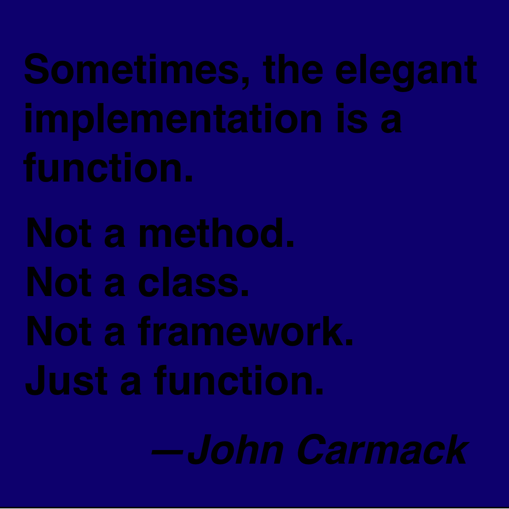
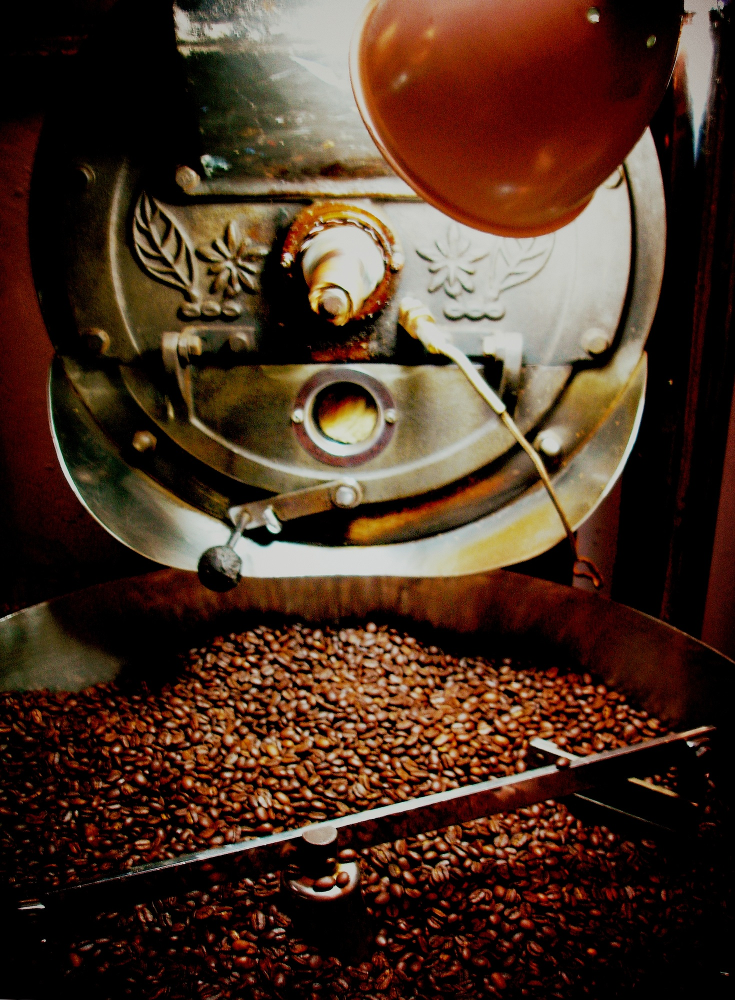

# La première gorgée : Fonctions Basiques {#functions}

## Aussi court que possible sur les fonctions, mais rien de moins

En JavaScript, les fonctions sont des valeurs, mais elles sont aussi beaucoup plus que de simples nombres, des chaînes ou même des structures de données complexes telles que des arbres ou des maps. Les fonctions représentent les calculs à effectuer. Comme les nombres, les chaînes et les tableaux, elles ont une représentation. Commençons par la fonction la plus simple possible. En JavaScript, cela ressemble à ceci :

    function () {}

C'est une fonction qui n'est appliquée à aucune valeur et ne produit aucune valeur. Comment représentons-nous "aucune valeur" en JavaScript ? Nous le découvrirons dans une minute. Tout d'abord, vérifions que notre fonction est une valeur :

    (function () {})
      //=> [Function]

Quoi !? Pourquoi n'a-t-il pas tapé en retour `function(){}` pour nous ? Cela *semble* enfreindre notre règle voulant que si une expression est aussi une valeur, JavaScript nous restituera la même valeur. Que se passe-t-il? La réponse la plus simple est que, bien que l'interpréteur JavaScript renvoie effectivement cette valeur, son affichage à l'écran est une question légèrement différente. `[Function]` est un choix fait par ceux qui ont écrit Node.js, l'environnement JavaScript hébergeant JavaScript REPL. Si vous essayez la même chose dans un navigateur, vous verrez le code que vous avez tapé.

{pagebreak}

A> Je préférerais autre chose, mais je dois accepter le fait que ce qui nous est dactylographié à l'écran est arbitraire, et tout ce qui compte, c'est qu'il soit quelque peu utile à la lecture par un humain. Mais nous devons comprendre que même si nous voyions `[Fonction]` ou `function(){}`, JavaScript a en interne une fonction complète et appropriée.

### fonctions et identités

Vous vous rappelez que nous avons deux types de valeurs en ce qui concerne l'identité : les types de valeur et les types de référence. Les types de valeur partagent la même identité s'ils ont le même contenu. Les types de référence ne le font pas.

Quel genre sont des fonctions? Essayons. Pour des raisons d'apaisement de l'analyseur JavaScript, nous allons placer nos fonctions entre parenthèses:

    (function () {}) === (function () {})
      //=> false

Comme les tableaux, chaque fois que vous évaluez une expression pour générer une fonction, vous obtenez une nouvelle fonction qui n'est pas identique à une autre fonction, même si vous utilisez la même expression pour la générer. "Fonction" est un type référence.

### appliquer les fonctions

Mettons les fonctions au travail. La façon dont nous utilisons les fonctions consiste à *les appliquer* à zéro ou plusieurs valeurs appelées *arguments*. Tout comme `2 + 2` produit une valeur (dans ce cas,` 4`), appliquer une fonction à zéro ou plusieurs arguments produit également une valeur.

Voici comment nous appliquons une fonction à certaines valeurs en JavaScript: Disons que *fn_expr* est une expression qui, une fois évaluée, produit une fonction. Appelons les arguments *args*. Voici comment appliquer une fonction à certains arguments :

  *fn_expr*`(`*args*`)`

Pour le moment, nous ne connaissons qu'une expression de ce type: `function(){}`, alors utilisons-la. Nous le mettrons entre parenthèses [^ambigu] pour que l’analyseur reste heureux, comme nous l’avons fait précédemment: `(function(){})`. Puisque nous ne lui donnons aucun argument, nous écrirons simplement `()` après l'expression. Alors nous écrivons :

    (function () {})()
      //=> undefined

Qu'est-ce que `undefined` ?

[^ambigus]: Si vous êtes habitué à d'autres langages de programmation, vous avez probablement intériorisé l'idée que parfois les parenthèses sont utilisées pour grouper des opérations dans une expression comme math, et parfois pour appliquer une fonction à des arguments. Sinon ... Bienvenue dans la famille de langages de programmation [ALGOL] !

[ALGOL]: https://fr.wikipedia.org/wiki/Algol_(langage)

### `undefined`

En JavaScript, l’absence de valeur s’écrit `undefined`, ce qui signifie qu’il n’ya pas de valeur. Il reviendra. `undefined` est son propre type de valeur et agit comme un type de valeur :

    undefined
      //=> undefined

Comme les nombres, les booléens et les chaînes, JavaScript peut afficher la valeur `undefined`.

    undefined === undefined
      //=> true
    (function () {})() === (function () {})()
      //=> true
    (function () {})() === undefined
      //=> true

Peu importe comment vous évaluez `undefined`, vous obtenez une valeur identique. `undefined` est une valeur qui signifie "je n'ai pas de valeur". Mais ça reste une valeur :-)

A> Vous pourriez penser que `undefined` en JavaScript est équivalent à `NULL` en SQL. Non. En SQL, deux éléments `NULL` ne sont pas égaux ni ne partagent la même identité, car deux inconnus ne peuvent pas être égaux. En JavaScript, chaque `undefined` est identique à tous les autres `undefined`.

### void

Nous avons vu que JavaScript représente une valeur non définie en tapant `undefined`, et nous avons généré des valeurs non définies de deux manières :

1. En évaluant une fonction qui ne renvoie pas de valeur `(function(){})()`, et;
2. En écrivant `undefined` nous-mêmes.

Il y a une troisième façon, avec l'opérateur `void` de JavaScript. Voir :

    void 0
      //=> undefined
    void 1
      //=> undefined
    void (2 + 2)
      //=> undefined

`void` est un opérateur qui prend n'importe quelle valeur et l'évalue toujours à `undefined`. Donc, lorsque nous voulons délibérément une valeur indéfinie, devrions-nous utiliser les première, deuxième ou troisième formes ? [^Quatrième] La réponse est, utilisez `void`. Par convention, utilisez `void 0`.

La première forme fonctionne mais elle est encombrante. La seconde forme fonctionne la plupart du temps, mais il est possible de la décomposer en réaffectant `undefined` à une valeur différente, ce dont nous discuterons dans [Réaffectation et Mutation](#reassignment). La troisième forme est garantie de toujours fonctionner, c'est ce que nous allons utiliser. [^Void]

[^Quatrième] : Les codeurs expérimentés en JavaScript sont conscients qu'il existe une quatrième façon, en utilisant un argument de fonction. C'était en fait le mécanisme préféré jusqu'à ce que `void` soit devenu banal.

[^void] : Comme un exercise pour le lecteur, nous vous suggérons de demander à votre amical concepteur de langage de programmation de quartier ou à votre expert en matière de facteurs humains d'expliquer pourquoi un mot clé appelé `void` est utilisé pour générer une valeur` undefined` au lieu de les appeler à la fois `void` ou les deux` undefined`. Nous n'en avons aucune idée.

### fonctions sans arguments et leurs corps

Retour à notre fonction. Nous avons évalué ceci :

    (function () {})()
      //=> undefined

Rappelons que nous appliquions la fonction `function(){}` à aucun argument (car il n'y avait rien à l'intérieur de `()`). Alors, comment savons-nous qu'il faut s'attendre à `undefined` ? C'est facile:

Lorsque nous définissons une fonction [^todonamed], nous écrivons le mot `function`. Nous mettons ensuite une liste d'arguments (éventuellement vide), puis nous donnons à la fonction un *corps* entre accolades `{...}`. Les corps de fonction sont des listes (éventuellement vides) *d'instructions* JavaScript séparées par des points-virgules.

Quelque chose comme : { instruction^1^; instruction^2^; instruction^3^; ... ; instruction^n^ }

Nous n'avons pas discuté de ces *instructions*. Qu'est-ce qu'une instruction ?

[^todonamed]: Fonctions appellée TODO: , probablement discuté dans une toute nouvelle section lorsque nous discutons du hissage `var`.

Il existe plusieurs types de déclarations JavaScript, mais le premier type est celui que nous avons déjà rencontré. Une expression est une déclaration JavaScript. Bien qu'elles ne soient pas très pratiques, les fonctions suivantes sont toutes des fonctions JavaScript valides et sont considérées comme indéfinies lorsqu'elles sont appliquées :

    (function () { 2 + 2 })

    (function () { 1 + 1; 2 + 2 })

Vous pouvez également séparer des instructions avec des sauts de ligne. [^asi] La convention est d'utiliser une forme d'indentation cohérente. :

    (function () {
      1 + 1;
      2 + 2
    })

    (function () {
      (function () {
        (function () {
          (function () {
          })
        })
      });
      (function () {
      })
    })

Ce dernier est un doozy, mais puisqu'un corps de fonction peut contenir une instruction, et une instruction peut être une expression, et une fonction est une expression ... Vous voyez l'idée.

[^asi]: Les lecteurs qui suivent les flame-fests sur Internet peuvent être conscients de quelque chose appelé [automatic semi-colon insertion](http://lucumr.pocoo.org/2011/2/6/automatic-semicolon-insertion/). Basiquement, il y a une étape où JavaScript examine votre code et suit certaines règles pour deviner où vous vouliez insérer des points-virgules si vous les omettez. Cette fonctionnalité a été créée à l'origine comme une sorte de correction d'erreur utile. Certains programmeurs font valoir que, puisque cela fait partie de la définition du langage, écrire du code qui l'exploite est un jeu juste. Par conséquent, ils omettent délibérément tout point-virgule que JavaScript leur insère.

Alors, comment pouvons-nous obtenir une fonction pour renvoyer une valeur lorsqu'elle est appliquée? Avec le mot-clé `return` et toute expression :

    (function () { return 0 })()
      //=> 0

    (function () { return 1 })()
      //=> 1

    (function () { return 'Hello ' + 'World' })()
      // 'Hello World'

Le mot-clé `return` crée une instruction return qui termine immédiatement l'application de la fonction et renvoie le résultat de l'évaluation de son expression.

### fonctions qui évaluent aux fonctions

Si une expression qui évalue une fonction est, eh bien, une expression et si une instruction return peut avoir n'importe quelle expression sur son côté droit ... *Peut-on mettre une expression qui évalue une fonction sur le côté droit d'une expression de fonction ?*

Oui :

    function () {
      return (function () {})
    }

C'est une fonction ! C'est une fonction qui, lorsqu'elle est appliquée, est évaluée à une fonction qui, lorsqu'elle est appliquée, est évaluée à `undefined`. [^mouthful] Utilison une terminology plus simple. Au lieu de dire "que quand c'est appliqué, ça évalue à \_\_\_\_\_," nous dirons "donne \_\_\_\_\_." Et au lieu de dire "donne undefined," nous dirons "ne donne rien."

Alors nous avons *une fonction, qui donne une fonction, qui ne donne rien*. également :

    function () {
      return (function () {
        return true
      })
    }

C'est une fonction, qui donne une fonction, qui donne `true`:

    (function () {
      return (function () {
        return true
      })
    })()()
      //=> true

Bien. Nous avons été très intelligents, mais jusqu'à présent, tout cela semble très abstrait. La diffraction d'un cristal est belle et intéressante en soi, mais vous ne pouvez pas nous en vouloir de vouloir lui montrer un usage pratique, comme pouvoir déterminer la composition d'une étoile à des millions d'années-lumière. Alors ... Dans le chapitre suivant, "[J'aimerais Avoir un Argument, S'il Vous Plait](#fargs)," nous allons voir comment faire des fonctions par la pratique.

[^mouthful]: What a mouthful! C’est la raison pour laquelle d’autres langages, particulièrement axées sur les fonctions, proposent des syntaxes telles que `-> -> undefined`

## Ah. J'Aimerais Avoir un Argument, S'Il Vous Plait.[^mp] {#fargs}

[^mp]: [The Argument Sketch](http://www.mindspring.com/~mfpatton/sketch.htm) de "Monty Python's Previous Record" et "Monty Python's Instant Record Collection"

Jusqu'à présent, nous avons examiné des fonctions sans arguments. Nous n'avons même pas dit quel argument *est*, seulement que nos fonctions n'en ont aucun.

A> La plupart des programmeurs sont parfaitement familiers avec les arguments (souvent appelés "paramètres"). Les mathématiques du secondaire parlent de ça. Donc, vous savez ce qu’ils représentent, et je sais que vous savez ce qu’ils sont, mais s'il vous plaît soyez patient avec l’explication !

Faisons une fonction avec un argument :

    function (room) {}

Cette fonction a un argument, `room`, et pas de corps. Voici une fonction avec deux arguments et sans corps :

    function (room, board) {}

Je suis sûr que vous êtes parfaitement à l'aise avec l'idée que cette fonction a deux arguments, `room`, et `board`. Que fait-on avec les arguments ? Les utiliser dans le corps, bien sûr. Qu'est-ce que vous pensez de ceci ?

    function (diameter) { return diameter * 3.14159265 }

C'est une fonction permettant de calculer la circonférence d'un cercle en fonction du diamètre. J'ai lu cela à haute voix comme "Appliquée à une valeur représentant le diamètre, cette fonction *renvoie* le diamètre multiplié par 3.14159265."

Rappelez-vous que pour appliquer une fonction sans arguments, nous avons écrit `(function () {})()`. Pour appliquer une fonction avec un argument (ou des arguments), on place l’argument (ou les arguments) entre parenthèses, comme ceci :

    (function (diameter) { return diameter * 3.14159265 })(2)
      //=> 6.2831853

Vous ne serez pas surpris de voir comment écrire et appliquer une fonction à deux arguments :

    (function (room, board) { return room + board })(800, 150)
      //=> 950

T> ### Un résumé rapide sur les fontions et les corps
T>
T> La façon dont les arguments sont utilisés dans l'expression d'un corps est probablement parfaitement évident pour vous d'après les exemples, surtout si vous avez utilisé un langage de programmation (à l'exception du dialecte BASIC - que je me souviens de mon école secondaire - qui n'autorisait pas les paramètres lorsque vous avez appelé une procédure).
T>
T> Les expressions soit des représentations de valeurs (comme `3.14159265`, `true`, et `undefined`), des opérateurs qui combinent les expressions (comme `3 + 2`), quelques formes spéciales comme `[1, 2, 3]` pour créer des tableaux à partir d'expressions, ou `function (`*arguments*`) {`*body-statements*`}` pour la création de fonctions.
T>
T> Une des déclarations importantes possibles est une déclaration de return. Une déclaration de return accepte toute expression JavaScript valide.
T>
T> Cette définition pauvre est récursive, nous pouvons donc intuitivement (ou utiliser notre expérience avec d'autres langages) que, puisqu'une fonction peut contenir une instruction return avec une expression, nous pouvons écrire une fonction qui renvoie une fonction ou un tableau contenant une autre expression de tableau. . Ou une fonction qui retourne un tableau, un tableau de fonctions, une fonction qui retourne un tableau de fonctions, ainsi de suite :
T>
T> <<(code/f1.js)

### appel par valeur {#call-by-value}

Comme la plupart des langages de programmation contemporains, JavaScript utilise "l'appel par valeur" [evaluation strategy]. Cela signifie que lorsque vous écrivez du code qui semble appliquer une fonction à une expression ou à des expressions, JavaScript évalue toutes ces expressions et applique les fonctions à la ou aux valeurs résultantes.

[evaluation strategy]: http://en.wikipedia.org/wiki/Evaluation_strategy

Donc quand vous écrivez :

    (function (diameter) { return diameter * 3.14159265 })(1 + 1)
      //=> 6.2831853

Ce qui se passe en interne est que l'expression `1 + 1` a été évaluée en premier, résultant en `2`. Puis notre fonction circonférence est appliquée à `2`.[^f2f]

[^f2f]: Nous avons dit que vous ne pouvez pas appliquer une fonction à une expression. Vous *pouvez* appliquer une fonction à une ou plusieurs fonctions. Les fonctions sont des valeurs! Cela a des applications intéressantes, et elles seront explorées beaucoup plus à fond dans la suite [Functions That Are Applied to Functions](#consumers).

### variables et liaisons

À l'heure actuelle, tout semble simple et direct, et nous pouvons passer aux arguments plus en détail. Et nous allons nous frayer un chemin à partir de `function (diameter) { return diameter * 3.14159265 }` jusqu'aux finctions comme :

    function (x) { return (function (y) { return x }) }

A> `function (x) { return (function (y) { return x }) }` semble complètement déjanté, comme si nous apprenions l'anglais langue secondaire et que l'enseignant nous promet que nous utiliserons bientôt des mots comme *anticonsitutianaliarisme*. Outre le désir d'utiliser des mots longs pour paraître impressionnant, cela ne semblera pas attrayant tant que nous ne serons pas disposés à discuter du rôle de l'Église anglicane dans la politique britannique du XIXe siècle.
A>
A> Mais il y a une autre raison d'apprendre le mot *anticonsitutianaliarisme*: Nous pourrions apprendre comment fonctionnent les préfixes et les postfixes dans la grammaire anglaise. C'est la même chose avec `function (x) { return (function (y) { return x }) }`. Il a en lui-même une signification importante et constitue également une excellente excuse pour en savoir plus sur les fonctions qui créent des fonctions, des environnements, des variables, etc.

Afin de parler de la façon dont cela fonctionne, nous devrions nous entendre sur quelques termes (vous les connaissez peut-être déjà, mais vérifions ensemble et synchronisons nos dictionnaires). Le premier `x`, celui dans `function (x) ...`, est un *argument*. Le `y` dans `function (y) ...` est un autre argument. Le second `x`, celui dans `{ return x }`, n'est pas un argument, *c'est une expression référençant une variable*. Les arguments et les variables fonctionnent de la même manière, qu'il s'agisse de `function (x) { return (function (y) { return x }) }`  ou tout simplement `function (x) { return x }`.

Chaque fois qu'une fonction est appelée ("invoqué" signifie "appliqué à zéro argument ou plus"), un nouvel *environnement* est créé. Un environnement est un dictionnaire (éventuellement vide) qui mappe des variables à des valeurs par leur nom. Le `x` dans l'expression que nous appelons une "variable" est lui-même une expression qui est évaluée en recherchant la valeur dans l'environnement.

Comment la valeur est-elle mise dans l'environnement ? Hé bien pour les arguments, c'est très simple. Lorsque vous appliquez la fonction aux arguments, une entrée est placée dans le dictionnaire pour chaque argument. Alors quand on écrit:

    (function (x) { return x })(2)
      //=> 2

Ce qui se passe est ceci :

1. JavaScript analyse tout cela comme une expression composée de plusieurs sous-expressions.
1. Il commence ensuite à évaluer l'expression, y compris l'évaluation des sous-expressions.
1. Une sous-expression, `function (x) { return x }` est évalué à une fonction.
1. Un autre, `2`, est évalué au nombre 2.
1. JavaScript évalue maintenant l'application de la fonction à l'argument `2`. Voici où ça devient intéressant ...
1. Un environnement est créé.
1. La veleur '2' est liée au nom 'x' dans l'environnement.
1. L'expression 'x' (le côté droit de la fonction) est évalué dans l'environnement que nous venons de créer.
1. La valeur d'une variable lorsqu'elle est évaluée dans un environnement est la valeur liée au nom de la variable dans cet environnement, qui est '2'
1. Et c'est ça notre résultat.

Lorsque nous parlons d’environnements, nous utilisons un [unsurprising syntax][json] pour montrer leurs liens : `{x: 2, ...}`. ce qui signifie que l'environnement est un dictionnaire et que la valeur `2` est liée au nom `x`, et qu'il pourrait y avoir d'autres choses dans ce dictionnaire dont nous ne discutons pas pour le moment.

[json]: http://json.org/

### appel par partage

Plus tôt, nous avons distingué les *types de valeur* de JavaScript de ses *types de référence*. À ce moment-là, nous avons examiné comment JavaScript distingue les objets identiques des objets qui ne le sont pas. Il est maintenant temps d'examiner à nouveau la distinction entre les types valeur et référence.

Il existe une propriété que JavaScript conserve de manière stricte: lorsqu'une valeur - n'importe quelle valeur - est transmise en tant qu'argument à une fonction, la valeur liée à l'environnement de la fonction doit être identique à l'original.

Nous avons dit que JavaScript lie les noms aux valeurs, mais nous n'avons pas précisé ce que signifie associer un nom à une valeur. Maintenant, nous pouvons élaborer: Lorsque JavaScript lie un type de valeur à un nom, il en fait une copie et place la copie dans l'environnement. Comme vous vous en souvenez, les types de valeur tels que les chaînes et les nombres sont identiques s'ils ont le même contenu. Donc, JavaScript peut faire autant de copies de chaînes, de nombres ou de booléens qu'il le souhaite.

Qu'en est-il des types de référence? JavaScript ne place des copies de valeurs de référence dans aucun environnement. JavaScript place *références* pour les types de référence dans les environnements, et lorsque la valeur doit être utilisée, JavaScript utilise la référence pour obtenir l'original.

Étant donné que de nombreuses références peuvent partager la même valeur et que JavaScript les transmet sous forme d'arguments, on peut dire que JavaScript implémente la sémantique "appel par partage". L'appel par partage est généralement compris comme une spécialisation d'appel par valeur. Il explique pourquoi certaines valeurs sont appelées types de valeur et d'autres valeurs, appelées types de référence.

Et avec cela, nous sommes prêts à examiner les *fermetures*. Lorsque nous combinons notre connaissance des types de valeur, des types de référence, des arguments et des fermetures, nous comprenons pourquoi cette fonction est toujours évaluée comme suit : `true` peu importe l'argument [^NaNPedantry] vous l'appliquez à :

    function (value) {
      return (function (copy) {
        return copy === value
      })(value)
    }

[^NaNPedantry]: Sauf si l'argument est NaN, qui n'est égal à rien, y compris lui-même

## Closures and Scope {#closures}

Il est temps de voir comment une fonction dans une fonction fonctionne :

    (function (x) {
      return function (y) {
        return x
      }
    })(1)(2)
      //=> 1

Tout d'abord, utilisons ce que nous avons appris ci-dessus. Étant donné `(`*une fonction*`) (`*un argument*`)`, nous savons que nous faisons un bind de la fonction à l'argument, créons un environnement, lions la valeur de l'argument au nom et évaluons l'expression de la fonction . Donc, nous le faisons d'abord avec ce code :

    (function (x) {
      return function (y) {
        return x
      }
    })(1)
      //=> [Function]

L'environnement appartenant à la fonction portant la signature `function (x) ...` devient `{x: 1, ...}` et le résultat de l'application de la fonction est une autre valeur de la fonction. Il est logique que la valeur du résultat soit une fonction, car l'expression du corps de `function (x) ...` est la suivante :

      function (y) {
        return x
      }

Alors maintenant, nous avons une valeur représentant cette fonction. Ensuite, nous allons prendre la valeur de cette fonction et l'appliquer à l'argument `2`, quelque chose comme ceci :

      (function (y) {
        return x
      })(2)

Il semble donc que nous obtenons un nouvel environnement `{y: 2, ...}`. Comment l'expression `x` va-t-elle être évaluée dans l'environnement de cette fonction ? Il n'y a pas de `x` dans son environnement, il doit venir d'ailleurs.

A> C’est d’ailleurs l’une des caractéristiques déterminantes de JavaScript et des langages de la même famille : S’ils permettent à des choses telles que des fonctions de s’emboîter les unes dans les autres et, dans l’affirmative, comment elles gèrent les variables "de fonction qui sont référencés à l'intérieur d'une fonction. Par exemple, voici le code équivalent en Ruby :
A>
A> <<(code/k.rb)
A>
A> Maintenant, profitons d'un Rallongé détendu avant de continuer!

### Si les fonctions sans variables libres sont pures, les fermetures sont-elles impures ?

La fonction `function (y) {return x}` est intéressante. Il contient une *variable libre*, `x`. [^nonlocal] Une variable libre est une variable qui n'est pas liée à la fonction. Jusqu'à présent, nous n'avons vu qu'un moyen de "faire un bind" à une variable, à savoir en passant un argument portant le même nom. Puisque la fonction `function (y) {return x}` n'a pas d'argument nommé `x`, la variable` x` n'est pas liée à cette fonction, ce qui la rend "libre".

[^nonlocal]: Vous avez pu également entendre le terme "variable non locale". [Les deux sont corrects.](https://en.wikipedia.org/wiki/Free_variables_and_bound_variables)

Maintenant que nous savons que les variables utilisées dans une fonction sont liées ou libres, nous pouvons bifurquer les fonctions dans celles avec des variables libres et celles sans :

  * Les fonctions ne contenant aucune variable libre sont appelées *fonctions pures*.
  * Les fonctions contenant une ou plusieurs variables libres sont appelées *fermetures*.

Les fonctions pures sont les plus faciles à comprendre. Ils signifient toujours la même chose, peu importe où vous les utilisez. Voici quelques fonctions pures que nous avons déjà vues :

    function () {}

    function (x) {
      return x
    }

    function (x) {
      return function (y) {
        return x
      }
    }

La première fonction ne contient aucune variable, donc aucune variable libre. La seconde n'a pas de variables libres, car sa seule variable est liée. Le troisième est en fait deux fonctions, l'une dans l'autre. `function (y) ...` a une variable libre, mais l'expression entière se réfère à `function (x) ...`, et elle n'a pas de variable libre: la seule variable dans son corps est `x`, qui est certainement lié à `function (x) ...`.

Nous en apprenons quelque chose: une fonction pure peut contenir une fermeture.

X>Si les fonctions pures peuvent contenir des fermetures, une fermeture peut-elle contenir une fonction pure? En utilisant uniquement ce que nous avons appris jusqu'à présent, essayez de composer une fermeture contenant une fonction pure. Si vous ne pouvez pas, expliquez pourquoi c'est impossible.

Les fonctions pures signifient toujours la même chose parce que toutes leurs "entrées" sont entièrement définies par leurs arguments. Pas si avec une fermeture. Si je vous présente cette fonction pure `function (x, y) {return x + y}`, nous savons exactement ce qu'elle fait avec `(2, 2)`. Mais qu'en est-il de cette fermeture : `function (y) {return x + y}`? Nous ne pouvons pas dire ce qu'il fera avec l'argument `(2)` sans comprendre la magie pour évaluer la variable libre `x`.

### c'est toujours l'environnement

Pour comprendre comment les fermetures sont évaluées, nous devons revisiter les environnements. Comme nous l'avons dit précédemment, toutes les fonctions sont associées à un environnement. Nous avons également agité quelque chose lorsque nous avons décrit notre environnement. Rappelez-vous que nous avons dit que l'environnement pour `(function (x) {return (function (y) {return x})}) (1)` est `{x: 1, ...}` et que l'environnement pour `( function (y) {return x}) (2)` est `{y: 2, ...}` ? Remplissons les blancs!

L’environnement de `(fonction (y) {return x}) (2)` est *actuellement* `{y: 2, '..': {x: 1, ...}}`. `'..'` signifie quelque chose comme "parent" ou "enceinte" ou "super-environnement". C'est l'environnement de `function (x) ...`, car la fonction `function (y) {return x}` est dans le corps de `function (x) ...`. Ainsi, chaque fois qu'une fonction est appliquée à des arguments, son environnement a toujours une référence à son environnement parent.

Et maintenant, vous pouvez deviner comment nous évaluons `(function (y) {return x}) (2)` dans l'environnement `{y: 2, '..': {x: 1, ...}}`. La variable `x` n'est pas dans l'environnement immédiat de `function (y) ...`, mais elle se trouve dans l'environnement de son parent, elle est donc évaluée à `1` et c'est ce que `(function (y) {return x }) (2)` retourne même si elle a fini par ignorer son propre argument.

A> `function (x) { return x }` est appelée Combinator ou Identity Function. `function (x) { return (function (y) { return x }) }` est appelée le K Combinator ou Kestrel. Certaines personnes sont tellement excitées par cela qu'elles écrivent des livres entiers à leur sujet, certains sont géniaux [génial][mock], ce--pendant devrais-je mettre ceux-là--sont [intéressant][intéressantes] si vous utilisez Ruby.

[mock]: http://www.amzn.com/0192801422?tag=raganwald001-20
[intéressant]: https://leanpub.com/combinators "Kestrels, Quirky Birds, and Hopeless Egocentricity"

Functions can have grandparents too:

    function (x) {
      return function (y) {
        return function (z) {
          return x + y + z
        }
      }
    }

Cette fonction fait à peu près la même chose que :

    function (x, y, z) {
      return x + y + z
    }

Seulement vous l'appelez avec `(1)(2)(3)` au lieu de `(1, 2, 3)`. L'autre grande différence est que vous pouvez l'appeler avec `(1)` et obtenir une fonction que vous pourrez appeler plus tard avec `(2)(3)`.

{pagebreak}

A> La première fonction est le résultat de [currying] la deuxième fonction. L'appel d'une curried fonction avec seulement certains de ses arguments est parfois appelé [application partielle]. Certains langages de programmation sont automatiquement curry et évaluent partiellement des fonctions sans qu'il soit nécessaire de les imbriquer manuellement.

[currying]: https://en.wikipedia.org/wiki/Currying
[application partielle]: https://en.wikipedia.org/wiki/Partial_application

### shadowy variables from a shadowy planet

Une chose intéressante se produit lorsqu'une variable porte le même nom que la variable d'un environnement ancêtre. Considérerons :

    function (x) {
      return function (x, y) {
        return x + y
      }
    }

La fonction `fonction (x, y) {return x + y}` est une fonction pure, car son `x` est défini dans son propre environnement. Bien que son parent définisse également un `x`, il est ignoré lors de l'évaluation de `x + y`. JavaScript recherche toujours une liaison en commençant par l'environnement propre des fonctions, puis par chaque parent jusqu'à ce qu'il en trouve un. La même chose est vraie de :

    function (x) {
      return function (x, y) {
        return function (w, z) {
          return function (w) {
            return x + y + z
          }
        }
      }
    }

When evaluating `x + y + z`, JavaScript will find `x` and `y` in the great-grandparent scope and `z` in the parent scope. The `x` in the great-great-grandparent scope is ignored, as are both `w`s. When a variable has the same name as an ancestor environment's binding, it is said to *shadow* the ancestor.

Lors de l'évaluation de `x + y + z`, JavaScript trouvera `x` et `y` dans la portée des arrière-grands-parents et `z` dans la portée du parent. Le `x` dans la portée arrière-arrière-arrière-grand-parent est ignoré, comme le sont les deux `w`. Lorsqu'une variable porte le même nom que la liaison d'un environnement ancêtre, on dit qu'elle *shadow* l'ancêtre.

C'est souvent une bonne chose.

### qui est venu en premier, l'œuf ou la poule ?

Ce comportement de fonctions pures et de fermetures a de très nombreuses conséquences qui peuvent être exploitées pour écrire un logiciel. Nous allons les explorer en détail et examiner certains des autres mécanismes fournis par JavaScript pour travailler avec des variables et des états mutables.

Mais avant cela, il y a une dernière question: où commence l'ascendance? S'il n'y a pas d'autre code dans un fichier, qu'est-ce que l'environnement parent de `function (x) {return x}` ?

JavaScript a toujours la notion d'au moins un environnement que nous ne contrôlons pas: un environnement global dans lequel de nombreuses choses utiles sont liées, telles que des bibliothèques remplies de fonctions standard. Ainsi, lorsque vous appelez `(function (x) {return x}) (1)` dans le REPL, son environnement complet va ressembler à ceci : `{x: 1, '..': `*environnement global*`}`.

Parfois, les programmeurs souhaitent éviter cela. Si vous ne souhaitez pas que votre code fonctionne directement dans l'environnement global, que pouvez-vous faire? Créer un environnement pour eux, bien sûr. Beaucoup de programmeurs choisissent d'écrire chaque fichier JavaScript comme ceci :

    // top of the file
    (function () {

      // ... lots of JavaScript ...

    })();
    // bottom of the file

Cela a pour effet d'insérer un nouvel environnement vide entre l'environnement global et vos propres fonctions: `{x: 1, '..': {'..': `*environnement global*`}}`. Comme nous le verrons plus tard, cela permet d'éviter que les programmeurs modifient accidentellement l'état global partagé par le code dans chaque fichier lorsqu'ils utilisent correctement le [mot-clé var](#var).

## Parlons Var {#let}

Jusqu'à présent, tout ce que nous avons vraiment vu sont des *fonctions anonymes*, des fonctions qui n'ont pas de nom. C’est là que l’accent est mis sur les fonctions, méthodes et procédures de dénomination. Nommer des éléments est un élément essentiel de la programmation, mais nous savons tous comment argumenter.

Il existe d'autres moyens de nommer des éléments en JavaScript, mais avant d'en apprendre quelques-uns, voyons ce que nous faisons. Revenons sur un exemple très simple :

    function (diameter) {
      return diameter * 3.14159265
    }

Quel est ce numéro "3.14159265" ? [Pi], évidemment. Nous aimerions le nommer pour pouvoir écrire quelque chose comme :

    function (diameter) {
      return diameter * Pi
    }

Afin de binder `3.14159265` au nom de `Pi`, nous aurions besoin d'un paramètre de `Pi` appliqué à un argument de `3.14159265`. Si nous mettons notre expression de fonction entre parenthèses, nous pouvons l'appliquer à l'argument de `3.14159265` :

    (function (Pi) {
      return ????
    })(3.14159265)

Que mettons-nous dans notre nouvelle fonction qui lie `3.14159265` au nom `Pi` lors de l'évaluation ? Notre circonférence fonctionne, bien sûr :

[Pi]: https://en.wikipedia.org/wiki/Pi

    (function (Pi) {
      return function (diameter) {
        return diameter * Pi
      }
    })(3.14159265)

Cette expression, une fois évaluée, renvoie une fonction calculant les circonférences. Il diffère de l'original en ce qu'il nomme la constante `Pi`. Testons le:

    (function (Pi) {
      return function (diameter) {
        return diameter * Pi
      }
    })(3.14159265)(2)
      //=> 6.2831853

Ça marche ! Nous pouvons lier tout ce que nous voulons dans une expression en l'enveloppant dans une fonction qui est immédiatement appelée avec la valeur que nous voulons lier.

### a immédiatement appelé les expressions de fonction

Les programmeurs JavaScript utilisent régulièrement l’idée d’écrire une expression qui dénote une fonction, puis l’applique immédiatement aux arguments. Expliquant le motif, Ben Alman a inventé le terme [Immediately Invoked Function Expression][iife], souvent abrégé en "IIFE". Comme nous le verrons dans un instant, un IIFE n'a pas besoin de paramètres:

    (function () {
      // ... do something here...
    })();

When an IIFE binds values to names (as we did above with `Pi`), retro-grouch programmers often call it "let."[^let] And confusing the issue, upcoming versions of JavaScript have support for a `let` keyword that has a similar binding behaviour.

Quand un IIFE lie des valeurs à des noms (comme nous l’avons déjà fait avec `Pi`), les programmeurs de rétro-grouch l’appellent souvent "let" [^Let]. Et confondant le problème, les versions à venir de JavaScript ont un support pour un mot clé `let` qui a un comportement contraignant similaire.

### var {#var}

Utiliser un IIFE pour lier des noms fonctionne, mais seul un masochiste écrit des programmes de cette manière en JavaScript. Outre tous les caractères supplémentaires, il souffre d'un problème sémantique fondamental: il existe une grande distance visuelle entre le `Pi` et la valeur `3.14159265` que nous lui lions. Ils devraient être plus proches. Y a-t-il un autre moyen?

Oui.

Une autre façon d'écrire notre "circonférence" serait d'aller à `Pi` avec l'argument du diamètre, quelque chose comme ceci :

    function (diameter, Pi) {
      return diameter * Pi
    }

Et vous pourriez l'utiliser comme ceci :

    (function (diameter, Pi) {
      return diameter * Pi
    })(2, 3.14159265)
      //=> 6.2831853

Cela diffère de notre exemple dans un environnement plutôt que dans deux. Nous avons un lien dans l'environnement de notre argumentation régulière, et un autre de notre "constante". C'est plus efficace, et c'est *presque* toujours le cas : un moyen de lier `3.14159265` à un nom lisible.

JavaScript gives us a way to do that, the `var` keyword. We'll learn a lot more about `var` in future chapters, but here's the most important thing you can do with `var`:

JavaScript nous donne un moyen de faire cela, le mot clé `var`. Nous en apprendrons plus sur `var` dans les chapitres à venir, mais voici la chose la plus importante que vous puissiez faire avec `var` :

    function (diameter) {
      var Pi = 3.14159265;

      return diameter * Pi
    }

Le mot clé `var` introduit une ou plusieurs liaisons dans l'environnement de la fonction en cours. Cela fonctionne comme nous voulons :

    (function (diameter) {
      var Pi = 3.14159265;

      return diameter * Pi
    })(2)
      //=> 6.2831853

Vous pouvez lier n'importe quelle expression. Les fonctions sont des expressions, vous pouvez donc lier des fonctions d'assistance :

    function (d) {
      var calc = function (diameter) {
        var Pi = 3.14159265;

        return diameter * Pi
      };

      return "The circumference is " + calc(d)
    }

Notice `calc(d)`? This underscores what we've said: if you have an expression that evaluates to a function, you apply it with `()`. A name that's bound to a function is a valid expression evaluating to a function.[^namedfn]

Avis `calc(d)` ? Cela souligne ce que nous avons dit: si vous avez une expression qui donne une fonction, vous l’appliquez avec `()`. Un nom lié à une fonction est une expression valide évaluation d'une fonction [^namedfn]

[^namedfn]: Nous en sommes au deuxième chapitre et nous avons finalement nommé une fonction. Sheesh.

A> C'est incroyable de voir comment une idée aussi importante - nommer des fonctions - peut être expliquée *en passant* en quelques mots. JavaScript est vraiment, vraiment correct: fonctionne comme "entités de première classe". Les fonctions sont des valeurs pouvant être liées à d'autres valeurs, transmises sous forme d'arguments, renvoyées par d'autres fonctions, etc.

Vous pouvez lier plusieurs paires nom-valeur en les séparant par des virgules. Pour plus de lisibilité, la plupart des gens mettent une liaison par ligne :

    function (d) {
      var Pi   = 3.14159265,
          calc = function (diameter) {
            return diameter * Pi
          };

      return "The circumference is " + calc(d)
    }

Ces exemples utilisent le mot-clé `var` pour lier des noms dans le même environnement que notre fonction. Nous pouvons également créer une nouvelle portée à l'aide d'un IIFE si nous souhaitons lier certains noms dans une partie d'une fonction :

    function foobar () {

      // do something without foo or bar

      (function () {
        var foo = 'foo',
            bar = 'bar';

        // ... do something with foo and bar ...

      })();

      // do something else without foo or bar

    }

[^let]: To be pedantic, both main branches of Lisp today define a special construct called "let." One, Scheme, [uses `define-syntax` to rewrite `let` into an immediately invoked function expression that binds arguments to values](https://en.wikipedia.org/wiki/Scheme_(programming_language)#Minimalism) as shown above. The other, Common Lisp, leaves it up to implementations to decide how to implement `let`.

[^let]: Pour être pédant, les deux branches principales de Lisp définissent aujourd'hui une construction spéciale appelée "let". L'un, Scheme, [uses `define-syntax` to rewrite `let` into an immediately invoked function expression that binds arguments to values](https://en.wikipedia.org/wiki/Scheme_(programming_language)#Minimalism) comme indiqué au dessus de. L'autre, Common Lisp, laisse le soin à l'implémentation de décider comment implémenter `let`.

[iife]: http://www.benalman.com/news/2010/11/immediately-invoked-function-expression/

## Naming Functions {#named-function-expressions}

Allons droit au but. Ce code ne nomme *pas* une fonction :

    var repeat = function (str) {
      return str + str
    };

Il ne nomme pas la fonction "répéter" pour la même raison que `var answer = 42` ne nomme pas le nombre `42`. Cet extrait de code lie une fonction anonyme à un nom dans un environnement, mais la fonction elle-même reste anonyme.

JavaScript *a* une syntaxe pour nommer une fonction, cela ressemble à ceci:

    var bindingName = function actualName () {
      //...
    };

Dans cette expression, `bindingName` est le nom de l'environnement, mais `actualName` est le nom réel de la fonction. Ceci est une expression de fonction *nommée*. Cela peut paraître déroutant, mais considérez les noms de liaison comme des propriétés de l’environnement, et non de la fonction elle-même. Et en effet le nom *est* une propriété:

    bindingName.name
      //=> 'actualName'

Dans ce livre, nous n'examinons pas les outils JavaScript, tels que les débogueurs intégrés aux navigateurs, mais nous noterons que lorsque vous parcourez des piles d'appels dans tous les outils modernes, le nom de la liaison de la fonction est ignoré, mais son nom actuel est affiché. utiles même s'ils n'obtiennent pas de liaison formelle, par exemple

    someBackboneView.on('click', function clickHandler () {
      //...
    });

Désormais, le nom réel de la fonction n'a aucun effet sur l'environnement dans lequel elle est utilisée. À blanc :

    var bindingName = function actualName () {
      //...
    };

    bindingName
      //=> [Function: actualName]

    actualName
      //=> ReferenceError: actualName is not defined

Donc, "actualName" n'est pas lié à l'environnement dans lequel nous utilisons l'expression de fonction nommée. Est-ce lié ailleurs ? Oui, ça l'est :

    var fn = function even (n) {
      if (n === 0) {
        return true
      }
      else return !even(n - 1)
    }

    fn(5)
      //=> false

    fn(2)
      //=> true

`even` est lié à la fonction elle-même, mais pas à l'extérieur. Ceci est utile pour créer des fonctions récursives.

### déclarations de fonction

Nous avons en fait enterré le fil. [^ Lede] Nommer des fonctions dans le but de déboguer n’est pas aussi important que ce que nous sommes sur le point de discuter. Il existe une autre syntaxe pour nommer et / ou définir une fonction. Cela s'appelle une *déclaration de fonction*, et cela ressemble à ceci :

    function someName () {
      // ...
    }

Cela se comporte un *peu* comme :

    var someName = function someName () {
      // ...
    }

En cela, il lie un nom dans l'environnement à une fonction nommée. Cependant, considérons ce morceau de code :

    (function () {
      return someName;

      var someName = function someName () {
        // ...
      }
    })()
      //=> undefined

C’est ce à quoi nous nous attendons compte tenu de ce que nous avons appris sur [var](# var) : Bien que `someName` soit déclaré plus tard dans la fonction, JavaScript se comporte comme si vous aviez écrit :

    (function () {
      var someName;

      return someName;

      someName = function someName () {
        // ...
      }
    })()

Qu'en est-il d'une déclaration de fonction sans `var` ?

    (function () {
      return someName;

      function someName () {
        // ...
      }
    })()
      //=> [Function: someName]

Aha ! Cela fonctionne différemment, comme si vous aviez écrit :

    (function () {
      var someName = function someName () {
        // ...
      }
      return someName;
    })()

Cette différence est intentionnelle de la part de la conception de JavaScript afin de faciliter un certain style de programmation dans lequel vous mettez la logique principale à l’avant et les "fonctions d’aide" en bas. Il n'est pas nécessaire de déclarer les fonctions de cette manière en JavaScript, mais il est essentiel de comprendre la syntaxe et son comportement (en particulier sa différence avec `var`) pour travailler avec le code de production.

### function declaration caveats[^caveats]

Les déclarations de fonction ne sont formellement supposées être faites qu'à ce que nous pourrions appeler le "niveau supérieur" d'une fonction. Bien que certains environnements JavaScript le permettent, cet exemple est techniquement illégal et constitue une mauvaise idée:

    // function declarations should not happen inside of
    // a block and/or be conditionally executed
    if (frobbishes.arePizzled()) {
      function complainToFactory () {
        // ...
      }
    }

Le gros problème avec les expressions telles que celle-ci est qu'elles peuvent très bien fonctionner dans votre environnement de test mais fonctionner différemment en production. Ou bien, cela peut fonctionner aujourd'hui et d'une manière différente lorsque le moteur JavaScript est mis à jour, par exemple avec une nouvelle optimisation.

Une autre mise en garde est qu'une déclaration de fonction ne peut pas exister à l'intérieur de *toute* expression, sinon c'est une expression de fonction. Donc, ceci est une déclaration de fonction:

    function trueDat () { return true }

Mais ce n'est pas :

    (function trueDat () { return true })

Les parenthèses en font une expression.

[^lede]: Un paragraphe de tête (ou lede) dans la littérature fait référence au paragraphe d'introduction d'un article, d'un essai, d'un reportage ou d'un chapitre de livre. En journalisme, le fait de ne pas mentionner les éléments les plus importants, les plus intéressants ou les plus captivants d'une histoire dans le premier paragraphe est parfois appelé "enterrer la vérité".

[^caveats]: Un certain nombre des mises en garde évoquées ici ont été décrites dans l'excellent article de Jyrly Zaytsev [Named function expressions demystified](http://kangax.github.com/nfe/).

## Combinators and Function Decorators {#combinators}

### higher-order functions

Comme nous l'avons vu, les fonctions JavaScript prennent des valeurs comme arguments et renvoient des valeurs. Les fonctions JavaScript étant des valeurs, les fonctions JavaScript peuvent prendre des fonctions en tant qu'arguments, des fonctions de retour ou les deux. En règle générale, une fonction qui prend des fonctions en tant qu'arguments ou qui retourne une fonction (ou les deux) est appelée fonction "d'ordre supérieur".

Voici une fonction très simple d'ordre supérieur qui prend une fonction en argument :

    function repeat (num, fn) {
      var i, value;

      for (i = 1; i <= num; ++i)
        value = fn(i);

      return value;
    }

    repeat(3, function () {
      console.log('Hello')
    })
      //=>
        'Hello'
        'Hello'
        'Hello'
        undefined

Les fonctions d'ordre supérieur dominent *JavaScript Rallongé*. Mais avant de continuer, nous allons parler de certains types spécifiques de fonctions d’ordre supérieur.

### combinators

Le mot "combinateur" a une signification technique précise en mathématiques :

> "A combinator is a higher-order function that uses only function application and earlier defined combinators to define a result from its arguments."--[Wikipedia][combinators]

[combinators]: https://en.wikipedia.org/wiki/Combinatory_logic "Combinatory Logic"

Si nous apprenions la logique combinatoire, nous commencerions par les combinateurs les plus élémentaires tels que `S`, `K` et `I`, puis nous passerions à des combinateurs pratiques. Nous apprendrions que les combinateurs fondamentaux sont nommés d'après des oiseaux, à l'instar du célèbre livre de Raymond Smullyan [Mock a Mockingbird][mock].

[mock]: http://www.amazon.com/gp/product/B00A1P096Y/ref=as_li_ss_tl?ie=UTF8&camp=1789&creative=390957&creativeASIN=B00A1P096Y&linkCode=as2&tag=raganwald001-20

Dans ce livre, nous utiliserons une définition plus vague de "combinator:" Les fonctions pures d'ordre supérieur qui n'utilisent que des arguments et retournent une fonction. Nous ne serons pas stricts quant à l’utilisation de combinateurs précédemment définis dans leur construction.

Commençons par un combinateur utile: la plupart des programmeurs l'appellent *Compose*, même si les logiciens l'appellent le combinateur B ou "Bluebird". Voici l'implémentation typique de la programmation [^bluebird] :

    function compose (a, b) {
      return function (c) {
        return a(b(c))
      }
    }

Disons que nous avons :

    function addOne (number) {
      return number + 1
    }

    function doubleOf (number) {
      return number * 2
    }

Avec `compose`, vous écrivez n'importe où

    function doubleOfAddOne (number) {
      return doubleOf(addOne(number))
    }

Vous pouvez aussi écrire :

    var doubleOfAddOne = compose(doubleOf, addOne);

Ce n’est bien sûr qu’un exemple parmi d’autres. Vous en trouverez beaucoup plus en parcourant les recettes de ce livre. Bien que certains programmeurs estiment qu’il ne devrait exister qu’une façon de le faire, le fait d’avoir des combinateurs disponibles et d’écrire explicitement avec beaucoup de symboles et de mots-clés présente certains avantages lorsqu’il est utilisé judicieusement.

### une déclaration équilibrée sur les combinateurs

Le code qui utilise beaucoup de combinateurs a tendance à nommer les verbes et les adverbes (comme `doubleOf`,` addOne` et `compose`) tout en évitant les mots-clés de langue et les noms de noms (comme `number`). Ainsi, un point de vue est que les combinateurs sont utiles lorsque vous souhaitez mettre l'accent sur ce que vous faites et sur la manière dont cela s'articule, et un code plus explicite est utile lorsque vous souhaitez mettre l'accent sur ce avec quoi vous travaillez.

### function decorators {#decorators}

Un *décorateur de fonction* est une fonction d'ordre supérieur qui prend une fonction en tant qu'argument, retourne une autre fonction, et la fonction renvoyée est une variante de la fonction argument. Voici un exemple ridicule de décorateur:

    function not (fn) {
      return function (argument) {
        return !fn(argument)
      }
    }

Ainsi, au lieu d'écrire `!SomeFunction (42)`, vous pouvez écrire `not(someFunction)(42)`. Peu de progrès. Mais comme pour `compose`, si vous avez :

    function something (x) {
      return x != null
    }

Ensuite, vous pouvez écrire soit :

    function nothing (x) {
      return !something(x)
    }

Ou :

    var nothing = not(something);

`not` is a function decorator because it modifies a function while remaining strongly related to the original function's semantics. You'll see other function decorators in the recipes, like [once](#once), [mapWith](#mapWith), and [maybe](#maybe). Function decorators aren't strict about being pure functions, so there's more latitude for making decorators than combinators.

`not` est un décorateur de fonctions car il modifie une fonction tout en restant fortement lié à la sémantique de la fonction d'origine. Vous verrez d'autres décorateurs de fonctions dans les recettes, comme [une fois](#once), [mapWith](#mapWith) et [peut-être](#maybe). Les décorateurs de fonctions ne sont pas stricts sur le fait d'être des fonctions pures. Il est donc plus facile de faire des décorateurs que des combinateurs.

[^bluebird]: Comme nous le verrons plus tard, cette implémentation du B Combinator est correcte dans des langages tels que Scheme, mais pour une utilisation véritablement polyvalente en JavaScript, elle doit gérer correctement le [function context](#context).

## Building Blocks {#buildingblocks}

Lorsque vous examinez les fonctions au sein de fonctions en JavaScript, vous y trouverez un peu de "code spaghetti". La force de JavaScript est que vous pouvez faire n'importe quoi. La faiblesse est que vous allez le faire. Il y a des ifs, des fors, des retours, tout a été jeté ensemble. Bien que vous n’ayez pas besoin de vous limiter à un petit nombre de modèles simples, il peut être utile de comprendre ces modèles afin de structurer votre code autour de blocs de construction de base.

### composition

L'un des plus élémentaires de ces blocs de construction est la *composition* :

    function cookAndEat (food) {
      return eat(cook(food))
    }

C'est vraiment aussi simple que ça: chaque fois que vous chaînez deux ou plusieurs fonctions, vous les composez. Vous pouvez les composer avec du code JavaScript explicite comme nous venons de le faire. Vous pouvez également généraliser la composition avec le B Combinator ou "composer" comme nous l’avons vu dans [Combinators and Decorators](#combinators) :

    function compose (a, b) {
      return function (c) {
        return a(b(c))
      }
    }

    var cookAndEat = compose(eat, cook);

Si c'était tout ce qu'il y avait à faire, la composition n'aurait pas beaucoup d'importance. Mais comme beaucoup de modèles, l’utiliser quand il s’applique ne représente que 20% de l’avantage. Les 80% restants proviennent de l'organisation de votre code de sorte que vous puissiez l'utiliser: Fonctions d'écriture pouvant être composées de différentes manières.

Dans les recettes, nous allons examiner un décorateur appelé [une fois](#once): Cela garantit qu’une fonction ne peut être exécutée qu’une fois. Par la suite, cela ne fait rien. Once est utile pour éviter que certains effets secondaires ne se répètent. Nous allons aussi regarder [peut-être](#maybe): Cela garantit qu’une fonction ne fait rien si on ne lui donne rien (comme `null` ou` undefined`) en tant qu’argument.

Bien entendu, vous n'avez pas besoin d'utiliser de combinateur pour implémenter l'une ou l'autre de ces idées, vous pouvez utiliser les instructions if. Mais `une fois` et` peut-être` composent, vous pouvez donc les chaîner à votre guise:

    function actuallyTransfer(from, to, amount) {
      // do something
    }

    var invokeTransfer = once(maybe(actuallyTransfer(...)));

### application partielle

Une autre composante de base est *l'application partielle*. Lorsqu'une fonction prend plusieurs arguments, nous "appliquons" la fonction aux arguments en l'évaluant avec tous les arguments, produisant une valeur. Mais que se passe-t-il si nous ne fournissons que certains des arguments? Dans ce cas, nous ne pouvons pas obtenir la valeur finale, mais nous pouvons obtenir une fonction qui représente une * partie * de notre application.

Le code est plus facile que les mots pour cela. La bibliothèque [Underscore] fournit une fonction d'ordre supérieur appelée *map*. [^headache] Elle applique une autre fonction à chaque élément d'un tableau, comme ceci :

    _.map([1, 2, 3], function (n) { return n * n })
      //=> [1, 4, 9]

Ce code implémente une application partielle de la fonction map en appliquant la fonction `function (n) {return n * n}` comme second argument :

    function squareAll (array) {
      return _.map(array, function (n) { return n * n })
    }

La fonction résultante - `squareAll` - est toujours la fonction map, c'est juste que nous avons déjà appliqué l'un de ses deux arguments. `squareAll` est bien, mais pourquoi écrire une fonction à chaque fois que nous voulons appliquer partiellement une fonction à une carte ? Nous pouvons faire abstraction de ce niveau supérieur. `mapWith` prend n'importe quelle fonction en tant qu'argument et retourne une fonction de carte partiellement appliquée.

    function mapWith (fn) {
      return function (array) {
        return _.map(array, fn)
      }
    }

    var squareAll = mapWith(function (n) { return n * n });

    squareAll([1, 2, 3])
      //=> [1, 4, 9]

Nous discuterons de nouveau de mapWith dans [les recettes](#mapWith). La chose importante à voir est que l'application partielle est orthogonale à la composition, et qu'elles fonctionnent bien ensemble :

    var safeSquareAll = mapWith(maybe(function (n) { return n * n }));

    safeSquareAll([1, null, 2, 3])
      //=> [1, null, 4, 9]

Nous avons généralisé la composition avec le combinateur `compose`. L'application partielle dispose également d'un combinateur, que nous verrons dans la recette [partielle](#partial).

[^bind]: Modern JavaScript provides a limited form of partial application through the `Function.prototype.bind` method. This will be discussed in greater length when we look at function contexts.

[^headache]: les implémentations JavaScript modernes fournissent une méthode de mappage pour les tableaux, mais l'implémentation d'Underscore fonctionne également avec les navigateurs plus anciens si vous travaillez avec ce mal de tête.

[Underscore]: http://underscorejs.org

## I'd Like to Have Some Arguments. Again. {#arguments-again}

Comme nous l'avons vu, lorsqu'une fonction est appliquée à des arguments (ou "appelés"), JavaScript lie les valeurs des arguments aux noms d'arguments de la fonction dans un environnement créé pour l'exécution de la fonction. Ce dont nous n’avons pas parlé, c’est que JavaScript lie également certains noms "magiques" en plus de ceux que vous mettez dans la liste des arguments.

Vous ne devriez jamais essayer de définir vos propres liaisons avec ces noms. Considérez-les en lecture seule à tout moment. Le premier s'appelle `this` et est lié à quelque chose appelé [context](#context) de la fonction. Nous allons explorer cela lorsque nous commencerons à discuter d'objets et de classes. La seconde est très intéressante, elle s'appelle `arguments`, et le plus intéressant, c'est qu'elle contient une liste d'arguments passés à la fonction :

    function plus (a, b) {
      return arguments[0] + arguments[1]
    }

    plus(2,3)
      //=> 5

Bien que `arguments` ressemble à un tableau, ce n'est pas un tableau: [^pojo] C'est plutôt un objet [^pojo] qui lie certaines valeurs à des propriétés avec des noms qui ressemblent à des entiers commençant par zéro :

    function args (a, b) {
      return arguments
    }

    args(2,3)
      //=> { '0': 2, '1': 3 }

`arguments` contient toujours tous les arguments passés à une fonction, quel que soit le nombre déclaré. Par conséquent, nous pouvons écrire `plus` comme ceci:

    function plus () {
      return arguments[0] + arguments[1]
    }

    plus(2,3)
      //=> 5

Lors de la discussion d'objets, nous discuterons des propriétés plus en profondeur. Voici quelque chose d'intéressant à propos de `arguments`:

    function howMany () {
      return arguments['length']
    }

    howMany()
      //=> 0

    howMany('hello')
      //=> 1

    howMany('sharks', 'are', 'apex', 'predators')
      //=> 4

L'utilisation la plus courante de la liaison `arguments` est de créer des fonctions pouvant prendre un nombre variable d'arguments. Nous verrons cela utilisé dans de nombreuses recettes, en commençant par [partial application](#simple-partial) and [ellipses](#ellipses).

[^pojo]: Nous verrons plus tard les tableaux [arrays](#arrays) etd [plain old javascript objects](#objects).

## Summary

T> ### Functions
T>
T> * Functions are values that can be part of expressions, returned from other functions, and so forth.
T> * Functions are *reference values*.
T> * Functions are applied to arguments.
T> * The arguments are passed by sharing, which is also called "pass by value."
T> * Function bodies have zero or more expressions.
T> * Function application evaluates whatever is returned with the `return` keyword, or to `undefined`.
T> * Function application creates a scope. Scopes are nested and free variable references closed over.
T> * Variables can shadow variables in an enclosing scope.
T> * `let` is an idiom where we create a function and call it immediately in order to bind values to names.
T> * JavaScript uses `var` to bind variables within a function's scope.

# The Recipe Cheat Sheet

In the recipes, you may see one or more of the following JavaScript constructs being used before being fully explained in the text. Here're some brief explanations to tide you over:

### apply and call

Functions are applied with `()`. But they also have *methods* for applying them to arguments. `.call` and `.apply` are explained when we discuss [function contexts](#context), but here are some examples:

    function plus (a, b) {
      return a + b
    }

    plus(2, 3)
      //=> 5

    plus.call(this, 2, 3)
      //=> 5

    plus.apply(this, [2, 3])
      //=> 5

### slice

Arrays have a `.slice` method. The function can always be found at `Array.prototype.slice`. It works like this:

    [1, 2, 3, 4, 5].slice(0)
      //=> [1, 2, 3, 4, 5]

    [1, 2, 3, 4, 5].slice(1)
      //=> [2, 3, 4, 5]

    [1, 2, 3, 4, 5].slice(1, 4)
      //=> [2, 3, 4]

Note that `slice` always creates a new array, so `.slice(0)` makes a copy of an array. The [arguments](#arguments-again) pseudo-variable is not an array, but you can use `.slice` with it like this to get an array of all or some of the arguments:

    Array.prototype.slice.call(arguments, 0)
      //=> returns the arguments in an array.

    function butFirst () {
      return Array.prototype.slice.call(arguments, 1)
    }

    butFirst('a', 'b', 'c', 'd')
      //=> [ 'b', 'c', 'd' ]

For simplicity and as a small speed improvement, `slice` is usually bound to a local variable:

    var __slice = Array.prototype.slice;

    function butFirst () {
      return __slice.call(arguments, 1)
    }

Or even:

    var __slice = Array.prototype.slice;

    function slice (list, from, to) {
      return __slice.call(list, from, to)
    }

    function butFirst () {
      return slice(arguments, 1)
    }

### concat

Arrays have another useful method, `.concat`. Concat returns an array created by concatenating the receiver with its argument:

    [1, 2, 3].concat([2, 1])
      //=> [1, 2, 3, 2, 1]

### function lengths

Functions have a `.length` property that counts the number of arguments declared:

    function (a, b, c) { return a + b + c }.length
      //=> 3

      # Recipes with Basic Functions

      

      Having looked at basic pure functions and closures, we're going to see some practical recipes that focus on the premise of functions that return functions.

      ### Disclaimer

      The recipes are written for practicality, and their implementation may introduce JavaScript features that haven't been discussed in the text to this point, such as methods and/or prototypes. The overall *use* of each recipe will fit within the spirit of the language discussed so far, even if the implementations may not.
      ## Partial Application {#simple-partial}

      In [Building Blocks](#buildingblocks), we discussed partial application, but we didn't write a generalized recipe for it. This is such a common tool that many libraries provide some form of partial application tool. You'll find examples in [Lemonad](https://github.com/fogus/lemonad) from Michael Fogus, [Functional JavaScript](http://osteele.com/sources/javascript/functional/) from Oliver Steele and the terse but handy [node-ap](https://github.com/substack/node-ap) from James Halliday.

      These two recipes are for quickly and simply applying a single argument, either the leftmost or rightmost.[^inspired] If you want to bind more than one argument, or you want to leave a "hole" in the argument list, you will need to either use a [generalized partial recipe](#partial), or you will need to repeatedly apply arguments. It is [context](#context)-agnostic.

          var __slice = Array.prototype.slice;

          function callFirst (fn, larg) {
            return function () {
              var args = __slice.call(arguments, 0);

              return fn.apply(this, [larg].concat(args))
            }
          }

          function callLast (fn, rarg) {
            return function () {
              var args = __slice.call(arguments, 0);

              return fn.apply(this, args.concat([rarg]))
            }
          }

          function greet (me, you) {
            return "Hello, " + you + ", my name is " + me
          }

          var heliosSaysHello = callFirst(greet, 'Helios');

          heliosSaysHello('Eartha')
            //=> 'Hello, Eartha, my name is Helios'

          var sayHelloToCeline = callLast(greet, 'Celine');

          sayHelloToCeline('Eartha')
            //=> 'Hello, Celine, my name is Eartha'

      As noted above, our partial recipe allows us to create functions that are partial applications of functions that are context aware. We'd need a different recipe if we wish to create partial applications of object methods.

      [^inspired]: `callFirst` and `callLast` were inspired by Michael Fogus' [Lemonad](https://github.com/fogus/lemonad). Thanks!

      ## Ellipses and improved Partial Application {#ellipses}

      The CoffeeScript programming language has a useful feature: If a parameter of a method is written with trailing ellipses, it collects a list of parameters into an array. It can be used in various ways, and the CoffeeScript transpiler does some pattern matching to sort things out, but 80% of the use is to collect a variable number of arguments without using the `arguments` pseudo-variable, and 19% of the uses are to collect a trailing list of arguments.

      Here's what it looks like collecting a variable number of arguments and trailing arguments:

          callLeft = (fn, args...) ->
            (remainingArgs...) ->
              fn.apply(this, args.concat(remainingArgs))

      These are very handy features. Here's our bogus, made-up attempt to write our own mapper function:

          mapper = (fn, elements...) ->
            elements.map(fn)

          mapper ((x) -> x*x), 1, 2, 3
            #=> [1, 4, 9]

          squarer = callLeft mapper, (x) -> x*x

          squarer 1, 2, 3
            #=> [1, 4, 9]

      JavaScript doesn't support [ellipses](http://en.wikipedia.org/wiki/Ellipsis), those trailing periods CoffeeScript uses to collect arguments into an array. JavaScript is a *functional* language, so here is the recipe for a function that collects trailing arguments into an array for us:

          var __slice = Array.prototype.slice;

          function variadic (fn) {
            var fnLength = fn.length;

            if (fnLength < 1) {
              return fn;
            }
            else if (fnLength === 1)  {
              return function () {
                return fn.call(
                  this, __slice.call(arguments, 0))
              }
            }
            else {
              return function () {
                var numberOfArgs = arguments.length,
                    namedArgs = __slice.call(
                      arguments, 0, fnLength - 1),
                    numberOfMissingNamedArgs = Math.max(
                      fnLength - numberOfArgs - 1, 0),
                    argPadding = new Array(numberOfMissingNamedArgs),
                    variadicArgs = __slice.call(
                      arguments, fn.length - 1);

                return fn.apply(
                  this, namedArgs
                        .concat(argPadding)
                        .concat([variadicArgs]));
              }
            }
          };

          function unary (first) {
            return first
          }

          unary('why', 'hello', 'there')
            //=> 'why'

          variadic(unary)('why', 'hello', 'there')
            //=> [ 'why', 'hello', 'there' ]

          function binary (first, rest) {
            return [first, rest]
          }

          binary('why', 'hello', 'there')
            //=> [ 'why', 'hello' ]

          variadic(binary)('why', 'hello', 'there')
            //=> [ 'why', [ 'hello', 'there' ] ]

      Here's what we write to create our partial application functions gently:

          var callLeft = variadic( function (fn, args) {
            return variadic( function (remainingArgs) {
              return fn.apply(this, args.concat(remainingArgs))
            })
          })

          // Let's try it!

          var mapper = variadic( function (fn, elements) {
            return elements.map(fn)
          });

          mapper(function (x) { return x * x }, 1, 2, 3)
            //=> [1, 4, 9]

          var squarer = callLeft(mapper, function (x) { return x * x });

          squarer(1, 2, 3)
            //=> [1, 4, 9]

      While we're at it, here's our implementation of `callRight` using the same technique:

          var callRight = variadic( function (fn, args) {
            return variadic( function (precedingArgs) {
              return fn.apply(this, precedingArgs.concat(args))
            })
          })

      Fine print: Of course, `variadic` introduces an extra function call and may not be the best choice in a highly performance-critical piece of code. Then again, using `arguments` is considerably slower than directly accessing argument bindings, so if the performance is that critical, maybe you shouldn't be using a variable number of arguments in that section.

      ## Unary

      In [Ellipses](#ellipses), we saw a function decorator that takes a function with a fixed number of arguments and turns it into a *variadic* function, a function taking any number of arguments. "Unary" is another function decorator, and it also modifies the number of arguments a function takes: Unary takes any function and turns it into a function taking exactly one argument.

      The most common use case is to fix a common problem. JavaScript has a `.map` method for arrays, and many libraries offer a `map` function with the same semantics. Here it is in action:

          ['1', '2', '3'].map(parseFloat)
            //=> [1, 2, 3]

      In that example, it looks exactly like the mapping function you'll find in most languages: You pass it a function, and it calls the function with one argument, the element of the array. However, that's not the whole story. JavaScript's `map` actually calls each function with *three* arguments: The element, the index of the element in the array, and the array itself.

      Let's try it:

          [1, 2, 3].map(function (element, index, arr) {
            console.log({element: element, index: index, arr: arr})
          })
            //=> { element: 1, index: 0, arr: [ 1, 2, 3 ] }
            //   { element: 2, index: 1, arr: [ 1, 2, 3 ] }
            //   { element: 3, index: 2, arr: [ 1, 2, 3 ] }

      If you pass in a function taking only one argument, it simply ignores the additional arguments. But some functions have optional second or even third arguments. For example:

          ['1', '2', '3'].map(parseInt)
            //=> [1, NaN, NaN]

      This doesn't work because `parseInt` is defined as `parseInt(string[, radix])`. It takes an optional radix argument. And when you call `parseInt` with `map`, the index is interpreted as a radix. Not good! What we want is to convert `parseInt` into a function taking only one argument.

      We could write `['1', '2', '3'].map(function (s) { return parseInt(s); })`, or we could come up with a decorator to do the job for us:

          function unary (fn) {
            if (fn.length == 1) {
              return fn
            }
            else return function (something) {
              return fn.call(this, something)
            }
          }

      And now we can write:

          ['1', '2', '3'].map(unary(parseInt))
            //=> [1, 2, 3]

      Presto!
      ## Tap {#tap}

      One of the most basic combinators is the "K Combinator," nicknamed the "kestrel:"

          function K (x) {
            return function (y) {
              return x
            }
          };

      It has some surprising applications. One is when you want to do something with a value for side-effects, but keep the value around. Behold:

          function tap (value) {
            return function (fn) {
              if (typeof(fn) === 'function') {
                fn(value)
              }
              return value
            }
          }

      `tap` is a traditional name borrowed from various Unix shell commands. It takes a value and returns a function that always returns the value, but if you pass it a function, it executes the function for side-effects. Let's see it in action as a poor-man's debugger:

          var drink = tap('espresso')(function (it) {
            console.log("Our drink is", it)
          });

          // outputs "Our drink is 'espresso'" to the console

      It's easy to turn off:

          var drink = tap('espresso')();

          // doesn't output anything to the console

      Libraries like [Underscore] use a version of `tap` that is "uncurried:"

          var drink = _.tap('espresso', function () {
            console.log("Our drink is", this)
          });

      Let's enhance our recipe so it works both ways:

          function tap (value, fn) {
            if (fn === void 0) {
              return curried
            }
            else return curried(fn);

            function curried (fn) {
              if (typeof(fn) === 'function') {
                fn(value)
              }
              return value
            }
          }

      Now you can write:

          var drink = tap('espresso')(function (it) {
            console.log("Our drink is", it)
          });

      Or:

          var drink = tap('espresso', function (it) {
            console.log("Our drink is", it)
          });

      And if you wish it to do nothing at all, You can write either:

          var drink = tap('espresso')();

      Or:

          var drink = tap('espresso', null);

      `tap` can do more than just act as a debugging aid. It's also useful for working with [object and instance methods](#tap-methods).

      [Underscore]: http://underscorejs.org
      ## Maybe {#maybe}

      A common problem in programming is checking for `null` or `undefined` (hereafter called "nothing," while all other values including `0`, `[]` and `false` will be called "something"). Languages like JavaScript do not strongly enforce the notion that a particular variable or particular property be something, so programs are often written to account for values that may be nothing.

      This recipe concerns a pattern that is very common: A function `fn` takes a value as a parameter, and its behaviour by design is to do nothing if the parameter is nothing:

          function isSomething (value) {
            return value !== null && value !== void 0;
          }

          function checksForSomething (value) {
            if (isSomething(value)) {
              // function's true logic
            }
          }

      Alternately, the function may be intended to work with any value, but the code calling the function wishes to emulate the behaviour of doing nothing by design when given nothing:

          var something = isSomething(value) ?
            doesntCheckForSomething(value) : value;

      Naturally, there's a recipe for that, borrowed from Haskell's [maybe monad][maybe], Ruby's [andand], and CoffeeScript's existential method invocation:

          function maybe (fn) {
            return function () {
              var i;

              if (arguments.length === 0) {
                return
              }
              else {
                for (i = 0; i < arguments.length; ++i) {
                  if (arguments[i] == null) return
                }
                return fn.apply(this, arguments)
              }
            }
          }

      `maybe` reduces the logic of checking for nothing to a function call, either:

          var checksForSomething = maybe(function (value) {
            // function's true logic
          });

      Or:

          var something = maybe(doesntCheckForSomething)(value);

      As a bonus, `maybe` plays very nicely with instance methods, we'll discuss those [later](#methods):

          function Model () {};

          Model.prototype.setSomething = maybe(function (value) {
            this.something = value;
          });

      If some code ever tries to call `model.setSomething` with nothing, the operation will be skipped.

      [andand]: https://github.com/raganwald/andand
      [maybe]: https://en.wikipedia.org/wiki/Monad_(functional_programming)#The_Maybe_monad
